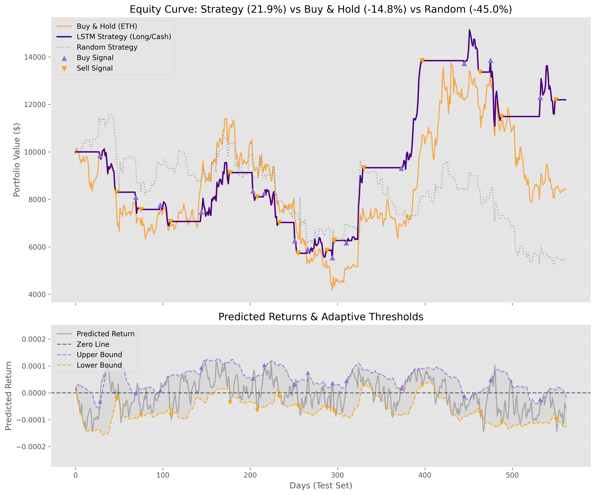
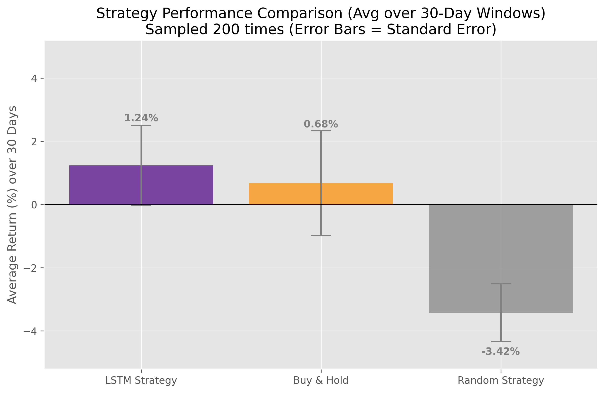

# Crypto Prediction with LSTM


## Project Overview
This project implements a Deep Learning model (LSTM) to predict the daily returns of Ethereum (ETH) and execute a robust trading strategy. Unlike traditional classifiers that simply predict "Up" or "Down", this model uses a **Regression** approach with a custom **Directional Huber Loss** to prioritize the *direction* of the price movement while maintaining sensitivity to magnitude.

The core innovation is the **Adaptive Threshold** mechanism, which filters out low-confidence predictions. This results in a "defensive" trading algorithm that aims to preserve capital during market downturns while capturing significant upside trends.

**Financial use case scenario:**
*Imagine an automated trading system that needs to navigate a highly volatile crypto market. The goal is not to trade every single day, but to identify high-probability opportunities and, crucially, to sit in cash when the market direction is uncertain or bearish. This tool acts as a risk-managed portfolio allocator.*

Created by Giulio Matteucci in 2026 as a financial data science portfolio project.

## Dataset
The data is fetched dynamically using the `yfinance` API.
- **Source**: Yahoo Finance.
- **Asset**: Ethereum (ETH-USD).
- **Period**: Daily data from 2018 to present.
- **Target Variable**: Next day's return.
- **Key Features**:
  - **Market Data**: Open, High, Low, Close, Volume.
  - **Macro Indicators**: S&P 500 (`^GSPC`), 10-Year Treasury Yield (`^TNX`), Volatility Index (`^VIX`), Bitcoin (`BTC-USD`).
  - **Technical Indicators**:
    - Trend: MACD, EMA (12, 26), SMA (20, 50).
    - Volatility: Bollinger Bands, ATR.
    - Momentum: RSI.

## Methodology

### 1. Data Engineering & Preprocessing
- **Feature Engineering**: Calculation of technical indicators and integration of macro-economic data to provide market context.
- **Scaling**: Robust scaling to handle outliers common in crypto data.
- **Sequence Generation**: Creation of rolling time-window sequences (30 days) for LSTM input.

### 2. Model Architecture
- **Model**: A 2-layer Long Short-Term Memory (LSTM) network with 128 hidden units and Dropout (0.1) to prevent overfitting.
- **Loss Function**: A custom **Directional Huber Loss**.
  
  $Loss = Huber(y, \hat{y}) + \lambda \cdot |y - \hat{y}| \cdot \mathbb{1}_{sign(y) \neq sign(\hat{y})}$

  This penalizes "sign errors" (predicting Up when market goes Down) significantly more than simple magnitude errors.

### 3. Trading Strategy
- **Adaptive Threshold**: The model calculates a rolling standard deviation of its own predicted returns. It only executes a trade if the predicted return magnitude exceeds `1.5 * Rolling_Std_Dev`.
- **Risk Management**: If the signal is weak, the strategy stays in Cash (0 return), effectively avoiding "chop" and bear markets.

### 4. Validation
- **Backtesting**: Simulation of the strategy on an unseen Test Set (approx. last 1.5 years).
- **Monte Carlo Sampling**: Comparison of strategy returns against 200 random samples of Buy & Hold and Random Trading over 30-day windows to ensure statistical significance.

## Key Findings (Jan 2026)

- **Strategy Outperformance**: Across the test period, the LSTM strategy achieved a **+21.9%** return, significantly outperforming the Buy & Hold approach which suffered a **-14.8%** loss due to market downturns.
- **Risk Mitigation**: The model's adaptive thresholding successfully filtered out low-confidence trades. This is evident when compared to the Random Strategy baseline, which incurred a massive **-45.0%** loss, highlighting the value of the model's selective trading.
- **Defensive Alpha**: The system demonstrates that profitability in volatile crypto markets is not just about predicting every move, but about avoiding significant drawdowns. The equity curve shows the strategy preserving capital (flat line) during the asset's steep declines.




*Figure: (Top) Equity curve comparing the LSTM Strategy (Purple) vs Buy & Hold (Orange). (Bottom) Bar chart comparison showing the final returns of the Strategy, Buy & Hold, and Random baseline (30-days return from random starting point in the test period).*

## 💻 Project Structure
```
├── misc/                                   # Images and assets
├── output/                                 # Generated plots and logs
├── check_gpu.py                            # Utility to verify CUDA
├── config.py                               # Hyperparameters and settings
├── data_loader.py                          # Data fetching (yfinance)
├── evaluator.py                            # Backtesting and plotting logic
├── main.py                                 # Main execution entry point
├── predict.py                              # Daily inference script
├── model.py                                # PyTorch LSTM definition
├── preprocessor.py                         # Feature engineering
├── trainer.py                              # Training loop with custom loss
├── utils.py                                # Logging and seeding utilities
├── requirements.txt                        # Python dependencies
└── README.md                               # Project documentation
```

## ⚙️ Installation & Usage

1. **Clone the repository**:
   ```bash
   git clone <repository-url>
   cd Crypto_prediction
   ```

2. **Set up the environment**:
   It is recommended to use Conda.
   ```bash
   conda create -n crypto_prediction python=3.10 -y
   conda activate crypto_prediction
   ```

3. **Install PyTorch with CUDA**:
   **Critical**: Install the version matching your CUDA driver.
   ```bash
   pip install torch --index-url https://download.pytorch.org/whl/cu121
   ```

4. **Install Dependencies**:
   ```bash
   pip install -r requirements.txt
   ```

5. **Run the Analysis**:
   ```bash
   python main.py
   ```

6.  **Daily Trading (Inference)**:
    To get the prediction for the next day without retraining:
    ```bash
    python predict.py
    ```
    This will output the predicted return and the recommended strategy action (BUY, SELL/CASH, HOLD).

## Dependencies
- Python 3.8+
- PyTorch (CUDA recommended)
- pandas, numpy
- yfinance
- scikit-learn
- matplotlib, seaborn
- ta (Technical Analysis library)
