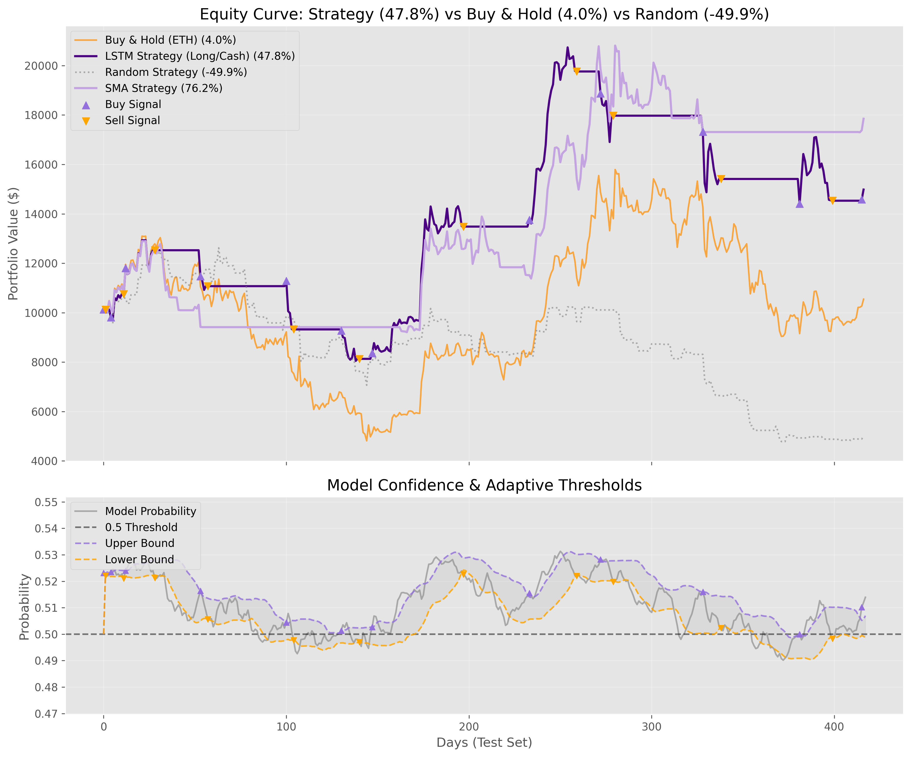
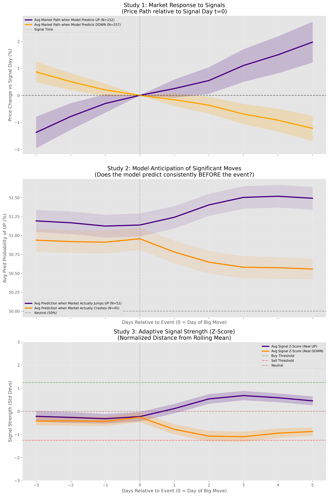
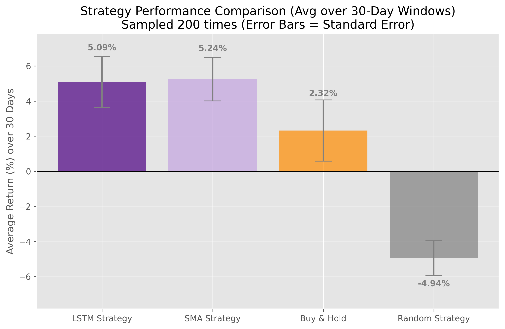

# Crypto Price Prediction


## Project Overview

This project aimed to build a predictive model for cryptocurrency markets (Ethereum) using advanced machine learning techniques (LSTM, Random Forest) and rigorous backtesting. 

**The Conclusion:** While ML models are powerful, our extensive testing reveals that for this specific timeframe and feature set, they *fail to reliably predict price variation* and offer no significant advantage over simple Trend Following strategies.

Instead of forcing a "black box" to work, this project serves as a **transparent, rigorous study** demonstrating market efficiency and showing that simple strategies can still achieve good results despite poor predictive performance.

| Architecture | Strategy Return | Sharpe Ratio | Win Rate vs SMA* |
| :--- | :--- | :--- | :--- |
| **LSTM (Deep Learning)** | +47.8% | 1.10 | 30.6% |
| **Simple SMA (Benchmark)** | **+76.2%** | **1.25** | - |
| **Buy & Hold** | +4.0% | 0.08 | - |

**Notes on metrics**  
* Strategy Return refers to the cumulative return over the full test period after transaction costs.  
* Sharpe Ratio is computed as the mean excess return divided by its standard deviation, providing a risk-adjusted measure of performance.
* Win Rate vs SMA indicates how often the ML Model beat the Simple Moving Average in 1,000 bootstrap simulations.

*> Note: The results presented above were generated on **January 6, 2026**. Since the pipeline continually fetches the latest data from Yahoo Finance, future executions may yield different numerical results.*

---

## Methodology & Rigor

The value of this project lies in the **integrity of the pipeline**, designed to prevent common pitfalls in financial ML:

1.  **Strict Leakage Prevention**: 
    *   StandardScaler fitted *only* on training data.
    *   Lagged technical indicators to ensure no look-ahead.
    *   Adaptive Thresholds calculated using only past information.
2.  **Robust Evaluation**:
    *   **Block Bootstrap Analysis**: Re-sampling data blocks to preserve volatility correlation while testing statistical significance.
    *   **Transaction Costs**: All backtests include a realistic 0.1% fee per trade.
    *   **Strategic Benchmarks**: Comparing not just to "Buy & Hold", but to a "Simple Moving Average" strategy to isolate the ML contribution.

---

## The "Deep Learning Trap"

We tested three increasing levels of model complexity:

1.  **Linear Models**: Logistic Regression.
2.  **Ensemble Models**: Random Forest.
3.  **Deep Learning**: LSTM.

### Findings
All three models converged to similar behavior. They essentially learned to be **"Momentum Filters"**.
*   The models learned that "if price went up recently, it might keep going up".
*   This imitation of momentum is indistinguishable from a simple Moving Average.
*   The "Adaptive Threshold" we implemented acted like a Momentum Filter.

<p align="center">
  
  <br>
  <em>Figure 1: The ML Model (Dark Purple) tracks the SMA Benchmark (Light Purple) almost perfectly, but with more noise and lower total return due to over-trading.</em>
</p>

---
## 🔍 Event Study: Searching for Latent Alpha

Despite the fact that the **Validation Loss** curve showed signs of overfitting (flatlining or increasing while training loss decreased), the model predictions were extremely biased towards predicting UP rather than DOWN (despite attempts to balance), and the accuracy hovered very close to 50% (apparent predictive failure), we investigated whether the model captured *any* true predictive signal.

We conducted an **Event Study Analysis** to visualize the market's behavior around the model's signals:

<p align="center">
  
  <br>
  <em>Figure 2: Event Study Analysis verifying signal quality.</em>
</p>

*   **Study 1 (Market Response)**: When the model predicts "UP" (Purple line), the average price path *does* trend positively over the next 5 days. However, the wide standard deviation (shaded areas) indicate high variance.
*   **Study 2 (Anticipation)**: We checked if the model predicts consistently *before* large market moves. There is a slight increase in probability leading up to big jumps, suggesting some sensitivity to volatility clustering.
*   **Conclusion**: There is a "faint" predictive signal, but it is likely detecting the onset of volatility regimes rather than truly predicting price direction.

---
## Statistical Validation

We utilized a **Bootstrap Analysis** to verify if the model's performance was due to skill or luck.

<p align="center">
  
  <br>
  <em>Figure 3: In rigorous random resampling 30-day sampling windows, the ML Strategy (Purple) performs similarly to the Simple Momentum Strategy (Pink), while both massively outperform Buy & Hold (Orange) and Random Trading (Grey).</em>
</p>

## Project Structure

This codebase provides a professional framework for anyone wishing to test their own signals:

```
├── misc/                       # Images and assets
├── output/                     # Generated plots, models, and logs
├── config.py                   # Centralized configuration for reproducible experiments
├── data_loader.py              # Data fetching module
├── evaluator.py                # Advanced plotting (Equity Curves, Event Studies, Bootstrap)
├── main.py                     # Orchestrator for Training, Optimization, and Evaluation
├── model.py                    # Implementations of LSTM, Linear, and RF wrappers
├── predict.py                  # Inference script for daily prediction
├── preprocessor.py             # Feature engineering pipeline
├── strategy_optimizer.py       # Methods to find optimal trading thresholds
├── trainer.py                  # Model training loop
└── requirements.txt            # Project dependencies
```

## How to Run

1.  **Install Dependencies**:
    ```bash
    pip install -r requirements.txt
    ```
2.  **Configure Experiment**:
    Edit `config.py` to switch between models:
    ```python
    MODEL_ARCH = 'lstm'   # or 'rf', 'linear'
    ```
3.  **Run Pipeline**:
    ```bash
    python main.py
    ```

## Final Thoughts

Predicting cryptocurrency price movements based solely on historical price and volume data is notoriously difficult. This project demonstrates that in efficient or trend-driven markets, simpler approaches often outperform complex ones.

Our analysis revealed that a basic **Momentum strategy (SMA) outperformed all Machine Learning models tested** (Linear, Random Forest, LSTM) on this dataset.

Importantly, this project highlights the absolute necessity of **rigorous statistical validation** and strict **measures against data leakage**. Without safeguards like the Bootstrap analysis and separate scaling used here, it is dangerously easy to be misled by backtests that look promising but fail to generalize.

From a predictive standpoint, the results reported here represent a negative result, consistent with market efficiency under the tested assumptions. While the system can still be engineered to outperform a passive Buy & Hold strategy (similarly to the SMA benchmark), the core finding remains: historical price and volume alone did not provide robust predictive power.

Crucially, this project highlights that in professional data science, a rigorously validated negative result is far more valuable than an unreliable positive one. The primary contribution of this work is therefore methodological: a transparent, reproducible pipeline for evaluating financial prediction models under realistic constraints.

